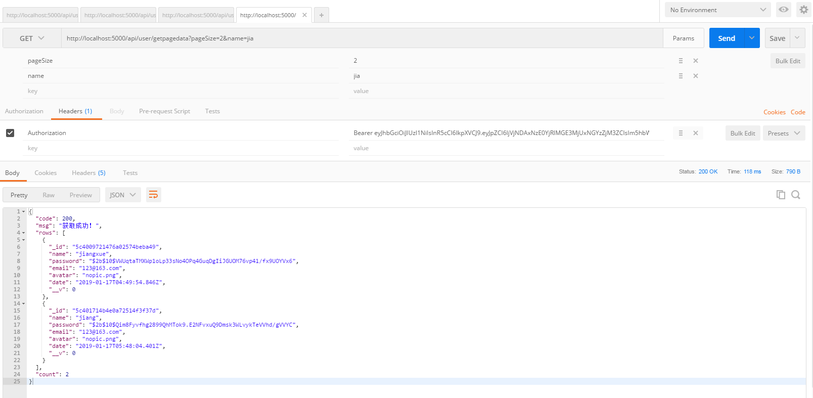

# koa-api 
使用 koa2写的后台接口

## 一、初始化项目
1. `npm init -y`
2. 安装 koa需要的基础包 `yarn add koa koa-router koa-json kcors koa-body koa-static koa-logger`

## 二、新建src目录和app.js文件,编写koa运行的基础代码
1. //src/router/routes.js  基本的路由
```javascript
const Router = require('koa-router')
// const musicCtrl = require('../controller/music')   // 这里引入controller

module.exports = app => {
    const router = new Router()

    const apiRouter = new Router()

    router.get('/', async(ctx,next) => {
        ctx.type = 'text/html'
        ctx.body = `<h1>这里是Koa首页</h1>`
    })

    // apiRouter.get('/music/focuslist',musicCtrl.focuslist)  //取焦点图列表

    //设定api路由为router的子路由
    router.use('/api', apiRouter.routes(), apiRouter.allowedMethods())
    
    //如果匹配不到路由则返回404
    router.all('/*', async (ctx, next) => {
        ctx.response.status = 404;
        ctx.response.body = `<h1>~~oops page not found!</h1>`
    })
    app.use(router.routes()).use(router.allowedMethods())
}
```
2. //src/config/config.js 基本的配置
```javascript
const env = process.env.NODE_ENV || 'development'

let port,database;

if(env === 'development') { // 如果是开发环境
    port = 5000
    database = {
        host: 'localhost',
        database: 'koa-test',
        username: 'root',
        password: '123456',
        port: '3306'
    }
}

if(env === 'production') {  //如果是生产环境
    
}

module.exports = {
    port,
    database
}
```
3. //src/app.js  koa基本代码
```javascript
const Koa = require('koa')
const path = require('path')
const fs = require('fs')
const koalogger = require('koa-logger')
const cors = require('kcors')
const json = require('koa-json')

const koaBody = require('koa-body')
const static = require('koa-static')                 //静态资源
const { port } = require('./config/config')
const router = require('./router/routes')
// const { formatDate } = require('./util/formatdate')


const app=new Koa()

app.use(static(path.join( __dirname,  './public')))
app.use(cors({credentials: true}))       //允许跨域,并且允许附带cookie
app.use(koalogger())
app.use(json())
app.use(koaBody({
    multipart:true, // 支持文件上传
    formidable:{
        uploadDir:path.join(__dirname,'public/upload/'),  // 设置文件上传目录,要确保这个文件夹已经存在,否则会报错
        keepExtensions: true,    // 保持文件的后缀
        //maxFieldsSize:2 * 1024 * 1024, // 所有的字段大小(不包括文件,默认是20M)
        //maxFileSize: 200*1024*1024,    //上传的文件大小限制,默认是200M
        onFileBegin:(name,file) => { // 文件上传前的设置
            // console.log(`name: ${name}`);
            // console.log(file);
            //检查上传的目录是否存在
            let upFolder = path.resolve(__dirname,'public/upload')   //放置于public目录(也就是静态资源目录,才好前端页面直接引用)
            let flag = fs.existsSync(upFolder)
            if(!flag) {   //如果目录不存在,先创建
                fs.mkdirSync(upFolder)
            }
        },
    }
}))

// 加载路由
router(app)

app.listen(port, ()=> {
    console.log(`server is running at http://localhost:${port}`)
})
```
## 三、安装开发环境的nodemon 并在package.json中配置启动脚本
`yarn add nodemon -D`
```
"scripts": {
    "dev": "nodemon -w src src/app.js",
    "test": "echo \"Error: no test specified\" && exit 1"
  },
```
现在可以启动试一试：
`npm run dev`

## 四、数据库
mongoose文档：https://mongoosejs.com/docs/index.html       
因为使用的是mongodb数据库, 安装 mongoose   
1. `yarn add mongoose`    
2. //src/config/config.js中增加 `mongodbUrl = 'mongodb://192.168.0.237:27017/test'` 并将它export
3. 在app.js中连接数据库
```javascript
const { port,mongodbUrl } = require('./config/config')

// mongodb数据连接
const mongoose = require('mongoose')
mongoose.connect(mongodbUrl,{useNewUrlParser:true})
    .then(() => console.log('mongodb connected success'))
    .catch(err => console.log(err))
```
4. 创建Scheme   //src/models/User.js
```javascript
const mongoose = require('mongoose')
const Schema = mongoose.Schema

// Create Schema
const UserSchema = new Schema({
    name: {
        type: String,
        required: true
    },
    password: {
        type: String,
        required: true
    },
    avatar: {
        type: String
    },
    email: {
        type: String,
        required: true
    },
    date: {
        type: Date,
        default: Date.now
    }
})

module.exports = User = mongoose.model('users',UserSchema)
```

## 五、路由、controller和service
+ 用户的密码是需要加密的，所以安装 bcrypt  `yarn add bcrypt` [bcrypt github网址](https://github.com/kelektiv/node.bcrypt.js)
  - 安装 bcrypt 时一直报node-pre-gyp ERR!错误 --解决办法：https://github.com/kelektiv/node.bcrypt.js/wiki/Installation-Instructions#microsoft-windows
  - 也即是全局安装 `cnpm install --global --production windows-build-tools`
+ bcrypt 加密
```javascript
let saltRounds = 10
let hashPwd
try {
    hashPwd = await bcrypt.hash(user.password,saltRounds)
    user.password = hashPwd
} catch (error) {
    return {code:0, msg:'密码加密时执行出错!'}
}
let re = await User.create(user)             //create 会返回插入到数据库后的doc对象,也即是会有_id
```
+ UserController
```javascript
const userService = require('../service/UserService')
const Result = require('../models/result')

let result = new Result()
module.exports = {
    getall: async (ctx) => {
        let { keyWord } = ctx.query
        let users = await userService.getall(keyWord)
        ctx.body = result.success('获取成功',users)
    },
    //注册
    registe: async (ctx,next) => {
        let user = ctx.request.body
        let re = await userService.registe(user)
        let backData
        if(re.code) {  //注册成功
            backData = result.success('注册成功！',re.data)
        }else {
            backData = result.error(re.msg)
        }
        ctx.body = backData
    },
    // 登录
    login: async (ctx,next) => {
        let user = ctx.request.body
        let re = await userService.login(user)
        let backData
        if(re.code) {  //登录成功-----
            backData = result.success('登录成功！',re.data)
        }else {
            backData = result.error(re.msg)
        }
        ctx.body = backData
    },
    // 删除用户
    delete: async(ctx) => {
        let { ids } = ctx.request.body
        console.log(`要删除的ids值：${ids}`)
        let re = await userService.delete(ids)
        let backData
        if(re.code) {  //删除成功
            backData = result.success('删除成功！')
        }else {
            backData = result.error(re.msg)
        }
        ctx.body = backData
    },
    // 修改用户资料
    update: async(ctx) => {
        let user = ctx.request.body
        let re = await userService.update(user)
        let backData
        if(re.code) {  //修改成功
            backData = result.success('修改成功！')
        }else {
            backData = result.error(re.msg)
        }
        ctx.body = backData
    },
    getuserinfo: async(ctx) => {
        let {_id='', name=''} = ctx.query
        let re = await userService.getuserinfo(_id,name)
        let backData
        if(re) {  //获取成功
            // re.password = '不告诉你'
            // 参考：https://koajs.com/#request
            let origin = ctx.request.origin
            re.avatar = re.avatar? origin+'/'+re.avatar : ''
            delete re.password  //不给前台传password字段
            backData = result.success('获取成功！',re)
        }else {
            backData = result.error(re.msg)
        }
        ctx.body = backData
    },
    // 获取分页数据, 这个方法的路由要视情况而定是用的post还是get请求
    getpagedata: async(ctx) => {
        let { pageIndex = 1, pageSize =20, name='' } = ctx.query
        pageIndex=Number(pageIndex),pageSize=Number(pageSize)
        // TODO: 组件其它的查询条件
        let con = {pageIndex, pageSize, name} 
        let backData       
        let pageData = await userService.getpagedata(con)
        backData = result.pageresult('获取成功！',pageData)
        ctx.body = backData
    }
}
```
+ UserService
```javascript
const User = require('../models/User')
const bcrypt = require('bcrypt')
const jwt = require('jsonwebtoken')
const { jwt_secret, expiresIn } = require('../config/config')

const saltRounds = 10

/* 获取一个期限为4小时的token */
function getToken(payload = {}) {
    return jwt.sign(payload, jwt_secret, { expiresIn: expiresIn })
}

module.exports = {
    // 获取所有用户
    getall: async (condition) => {
        let result 
        //如果有传查询关键字, 查询 name的模糊匹配(使用的正则)
        let con = condition? {name: new RegExp(condition,"i") }: {}
        result = await User.find(con)
        return result
    },
    // 注册
    registe: async(user) => {
        const u = await User.findOne({ name : user.name })
        let result
        if(u) {
            result = { code: 0, msg: `用户名${user.name}已经存在`}
            return result
        }
        // 将数据插入到数据库中
        // 加密密码
        let hashPwd
        try {
            hashPwd = await bcrypt.hash(user.password,saltRounds)
            user.password = hashPwd
        } catch (error) {
            return {code:0, msg:'密码加密时执行出错!'}
        }
        let re = await User.create(user)             //create 会返回插入到数据库后的doc对象,也即是会有_id
        // 生成 token
        let token = getToken({ _id:u._id, name:user.name,password: user.password, role:re.role })
        result = { code : 1, data: token }
        return result
    },
    // 登录
    login: async(user) => {
        const u = await User.findOne({ name : user.name })
        let result
        if(!u) {
            result = { code: 0, msg: `用户不存在,请重新输入`}
            return result
        }
        // 比较密码是否一致
        try {
            let flag = await bcrypt.compare(user.password,u.password)
            if(!flag) {
                result = { code: 0, msg: `密码不正确`}
                return result
            }
        } catch (error) {
            return {code:0, msg:'比较加密密码时执行出错!'}
        }
        // 生成 token
        let token = getToken({ _id:u._id, name:user.name,password: u.password, role:u.role })
        result = { code: 1, data: token }
        return result
    },
    // 删除用户
    delete: async (ids) => {
        let result 
        let re = await User.remove({ _id: { $in: ids } })
        console.log("Promise返回结果：",re)
        result = { code : 1 }
        return result
    },
    // 修改用户资料
    update: async (user) => {
        const u = await User.findById(user._id)
        let result
        if(!u) {
            result = { code: 0, msg : `您要修改的用户不存在`}
            return result
        }
        // 更新数据
        let updating = { name, email, avatar, role} = user
        await User.updateOne({_id:user._id},updating)
        result = { code : 1 }
        return result
    },
    // 根据id 或者用户名获取用户资料
    getuserinfo: async(id,name) => {
        let u
        if(id) {
            u = await User.findById(id)
        }else if(name) {
            u= await User.findOne({name})
        }
        return u
    },
    // 获取分页数据
    getpagedata: async(con) => {
        /*  使用sequelize的分页数据获取
        let offset = (pageIndex-1)*pageSize
        let singers = await Singer.findAndCountAll({
            where: {
                index: {[Op.eq]:index},
                area: {[Op.eq]:area}
            },
            offset,
            limit: pageSize
        })
        return singers
        */
        let {pageIndex,pageSize} = con
        let offset = (pageIndex-1)*pageSize
        let condition = {}
        if(con.name) {
            condition.name = new RegExp(con.name,"i")   // 根据名字模糊查询
        }
        let count = await User.countDocuments(condition)  // 计算某个条件的数据数量
        let rows = await User.find(condition).skip(offset).limit(pageSize)   // 使用offset和limit的方式获取当前页的数据
        return {rows,count}
    }
}
```
+ 路由
```javascript
const apiRouter = new Router()

apiRouter.post('/user/registe',userCtrl.registe)  // 用户注册
apiRouter.post('/user/login',userCtrl.login)      // 用户登录
apiRouter.delete('/user/delete',userCtrl.delete)    // 删除用户
apiRouter.post('/user/update',userCtrl.update)    // 修改用户资料
apiRouter.get('/user/getall',userCtrl.getall)    // 查询所有
apiRouter.get('/user/getuserinfo',userCtrl.getuserinfo)    // 获取用户资料
apiRouter.get('/user/getpagedata',userCtrl.getpagedata)    // 查询分页数据

//设定api路由为router的子路由
router.use('/api', apiRouter.routes(), apiRouter.allowedMethods())
```

## 六、jsonwebtoken 身份验证
1. 安装 [`koa-jwt`](https://github.com/koajs/jwt) 和 [`jsonwebtoken`](https://github.com/auth0/node-jsonwebtoken)
  - `yarn add koa-jwt jsonwebtoken`
  - 使用参考： http://www.php.cn/js-tutorial-395521.html  及  https://github.com/yunzaifei/koa2-jwt-demo
2. 先在//src/config/config.js中准备两个基本数据
```javascript
let jwt_secret = 'qwqasdf#$123$%##*(&&!@#aic'    // 用于jsonwebtoken的加密串
let expiresIn = '4h'    //身份过期时间 4h=4小时
module.exports = {
    ...
    jwt_secret,
    expiresIn
}
```
3. 在//src/app.js中配置并使用 koa-jwt
```javascript
const jwtKoa = require('koa-jwt'); // 用于路由权限控制
const { port, mongodbUrl, jwt_secret } = require('./config/config')

/* 路由权限控制 */
app.use(jwtKoa({ secret: jwt_secret }).unless({
    // 设置login、registe接口，可以不需要认证访问   
    path: [   
        /^\/api\/user\/login/,   
        /^\/api\/user\/registe/,   
        /^((?!\/api).)*$/ // 设置接口外的其它资源，可以不需要认证访问   
    ]   
}))
```
4. 获取token
```javascript
const jwt = require('jsonwebtoken')
const { jwt_secret, expiresIn } = require('../config/config')

/* 获取一个期限为4小时的token */
function getToken(payload = {}) {
    return jwt.sign(payload, jwt_secret, { expiresIn: expiresIn })
}

// 生成 token
let token = getToken({ id:u._id, name:user.name,password: u.password })
result = { code: 1, data: token }
return result
```
5. 为了方便使用,而不是把所有的代码都写在app.js里面,建立一个middleware文件夹, 放置一些中间件（步骤3中写的中间件也提取放middleware里）,        
例如此处把客户端传过来的 Authorization 也即token解析,把登录用户信息赋值给ctx.user,方便其它地方直接使用  //src/middleware/index.js
```javascript
const jwt = require('jsonwebtoken')
const jwtKoa = require('koa-jwt'); // 用于路由权限控制
const { jwt_secret } = require('../config/config')

// 一些中间件
module.exports = (app) => {
    /* 401未授权返回自定义的数据格式 */
    app.use(async function (ctx, next) {     //如果返回的是401未授权status
        try {
            await next()
        }
        catch (err) {
            if (401 == err.status) {
                ctx.status = 200  //这里还是给个成功的返回,只是将code设置成401
                ctx.body = { code: 401, msg: '您未提供Authorization header或者身份过期,请登录获取。' }
            } else {
                throw err
            }
        }
    })
    /* 路由权限控制 */
    app.use(jwtKoa({ secret: jwt_secret }).unless({
        // 设置login、registe接口，可以不需要认证访问   
        path: [
            /^\/api\/user\/login/,
            /^\/api\/user\/registe/,
            /^((?!\/api).)*$/ // 设置接口外的其它资源，可以不需要认证访问   
        ]
    }))

    app.use(async function (ctx, next) {     // 如果是携带了token的请求,解析这个token并 放置在ctx.user下
        try {
            const authorization = ctx.header.authorization  // 获取jwt
            if (authorization) {
                let token = authorization.split(' ')[1]
                if (token && token.length > 10) { //客户端传过来的Authorization: Bearer null会被解析成token为"null",简单点用长度来过滤
                    let payload = await jwt.verify(token, jwt_secret)  // 解密，获取payload
                    ctx.user = payload
                }
            }
            await next()
        }
        catch (err) {    //这个中间件不做任何路由拦截处理，因为koa-jwt已经做了, 这个中间件的作用是，如果token能够解析正确，就把它解析成登录用户对象并赋值给 ctx.user
            throw err
        }
    })
}
```
6. `app.js`中使用上面的中间件
```javascript
const middleware = require('./middleware')         //自定义的一些中间件

const app=new Koa()
middleware(app)
```
## 七、给返回的图片加上相应的前缀
如用户头像,因为是用的本地资源,为了方便前端使用,返回完整的地址  http://localhost:5000/images/01.png
```javascript
// 参考：https://koajs.com/#request
let origin = ctx.request.origin
re.avatar = re.avatar? origin+re.avatar : ''
```
## 八、补充mongodb分页数据（见上面的controller和service）
1. 

2. [mongodb的查询条件写法](https://docs.mongodb.com/manual/reference/operator/query/)
3. [mongoose使用](https://mongoosejs.com/docs/api.html#model_Model.find)

## 九、 加入log4js写日志  
`yarn add log4js`  
准备好 `//src/config/log_config.js`日志配置文件 和 `//src/util/logUtil.js`写日志助手    
在 `//src/app.js`中加入中间件  注意中间件的顺序
```javascript
//引入log4js帮助js
const logUtil = require('./util/logUtil')
app.use(async (ctx, next) => {       // 写日志的中间件, 此中间件应放在业务中间件的前面    
    const start = new Date()         //响应开始时间    
    var ms                           //响应间隔时间
    try {        
        await next()                 //开始进入到下一个中间件
        ms = new Date() - start
        //记录响应日志
        // logUtil.logResponse(ctx, ms)
    } catch (error) {
        ms = new Date() - start
        //记录异常日志
        logUtil.logError(ctx, error, ms)
    }
})
```
## 十、 头像上传处理
```javascript
/*
    注意客户端传递的_id值,不要随意乱写,即便是不存在的id,否则后台会出现转换错误, 因为mongodb是ObjectId, 最起码给的_id字符串要先能转换成ObjectId
    uploadUrl() {
        return `${apiAddr}user/uploadAvatar?_id=5c41572ec4036b36206c9eaf`
    },
*/
// 路由
apiRouter.post('/user/uploadAvatar',userCtrl.uploadAvatar) //更换头像

// controller
uploadAvatar: async(ctx) => {
    let uploadFiles = ctx.request.files
    let {_id} = ctx.request.query
    let uploadImg = uploadFiles
    let origin = ctx.request.origin
    let avatarUrl = path.basename(uploadImg.file.path)

    let re = await userService.uploadAvatar(_id,avatarUrl)
    ctx.body = result.success('更新成功',origin+"/upload/"+avatarUrl)
}
// service
uploadAvatar: async(_id,avatarUrl) => {
    const u = await User.findById(_id)
    let result = { code : 1 }
    if(u) {
        // 更新头像       
        let updating = { avatar: avatarUrl }
        let re = await User.updateOne({_id},updating)
        // result = { code : 1 }            
    }
    return result
}
```

## 十一、 Joi数据验证
1. 安装：`yarn add joi`  [joi github](https://github.com/hapijs/joi)
2. 使用： [参考1](https://blog.csdn.net/u013707249/article/details/79034138)   [参考2](https://www.cnblogs.com/zzbo/p/5906101.html)
  - `//src/models/validators/UserJoi.js`
```javascript
const Joi = require('joi');

const schema = Joi.object().keys({
    name: Joi.string().alphanum().min(3).max(16).required(),
    password: Joi.string().regex(/^[a-zA-Z0-9]{3,16}$/),
    role: Joi.string().required(),
    email: Joi.string().email({ minDomainAtoms: 2 })
})

module.exports = UserJoi = schema
```
  - `//src/models/validators/ProfileJoi.js`
```javascript
const Joi = require('joi');

const schema = Joi.object().keys({
    type: Joi.string().min(3).max(16).required(),
    income: Joi.string().required(),
    expend: Joi.string().required(),
    cash: Joi.string().required()
})

module.exports = ProfileJoi = schema
```
  - `//src/controller/UserControler.js`
```javascript
const Joi = require('joi')
const UserJoi = require('../models/validators/UserJoi')

let user = ctx.request.body
const { error } = Joi.validate(user, UserJoi,{ abortEarly: false, allowUnknown:true })
if(error) {
    ctx.body = result.error('数据验证不通过,请提供正确的数据格式',error)
    return
}
```
3. 效果    


